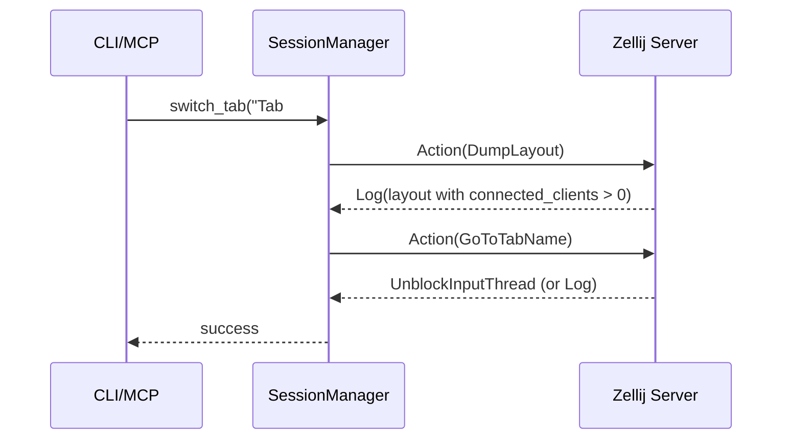
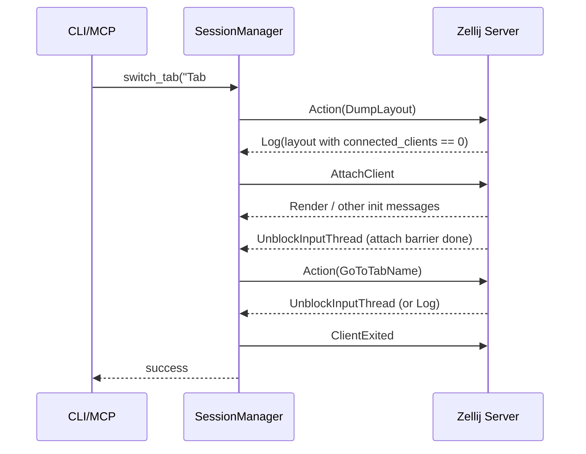
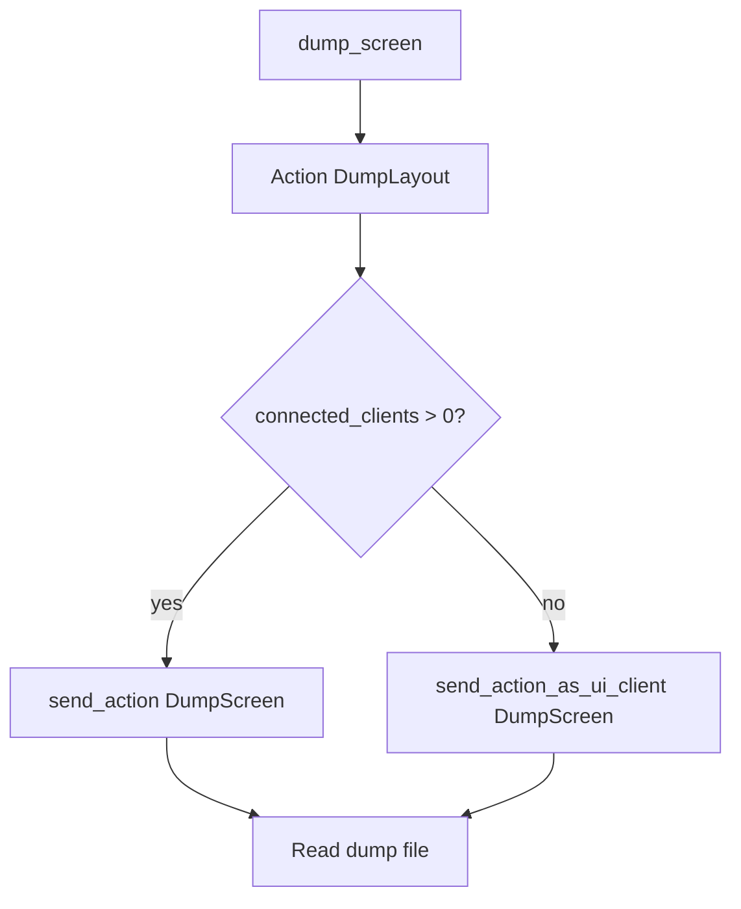

# Action Execution And UI Attach Strategy

- Status: Draft
- Last Updated: 2026-03-06
- Target Version: zellij-mcp-server 1.0.x / zellij 0.44.x

## 1. Background

项目需要同时满足两类场景：

- 有真实 UI 客户端在线（用户已在终端 `zellij attach`）
- 无 UI 客户端在线（headless，会话仍在运行）

其中 `DumpScreen`、`GoToTabName` 等动作在 headless 时不能直接走普通 CLI action，
需要先把当前连接注册为 UI 客户端。早期实现采用固定 `sleep` 和统一完成信号，
会出现竞态和不稳定结果。

## 2. Goals

- 让 action 完成判定与动作语义匹配，避免竞态。
- 降低不必要的 `AttachClient` / `ClientExited` 次数。
- 保持 headless 场景可用。

## 3. Non-Goals

- 当前版本不实现“永久常驻模拟客户端”。
- 当前版本不改动 zellij 上游协议。

## 4. Current Design

## 4.1 Reply Mode By Action

`send_action()` / `send_action_as_ui_client()` 不再使用单一完成条件，
而是根据动作类型选择回复模式：

- `LogOnly`: `QueryTabNames`, `DumpLayout`
- `UnblockOrLog`: 其他动作

这避免了“attach 阶段产生的 `UnblockInputThread` 被误判为业务 action 完成”的问题。

## 4.2 Attach Barrier (No Fixed Sleep)

`send_action_as_ui_client()` 流程：

1. 发送 `AttachClient`
2. 进入 attach barrier，显式消费初始化消息直到 attach 完成
3. 发送真实 action
4. 按 action reply mode 等待结果
5. 发送 `ClientExited` 清理客户端

该流程替代固定 `sleep`，降低时序不稳定。

## 4.3 Smart Attach Reduction

对于 UI-sensitive 动作，不再无条件 attach，而是先判断是否已有活跃 UI 客户端：

- 若 `connected_clients > 0`，优先走 `send_action()`（不 attach）
- 否则走 `send_action_as_ui_client()`（按需 attach）

当前落地点：

- `switch_to_tab()`
- `dump_screen_lines()`

## 5. Behavior Matrix

| Action | Active UI Clients > 0 | Headless |
| --- | --- | --- |
| `list_tabs` (`QueryTabNames`) | `send_action` | `send_action` |
| `show_layout` (`DumpLayout`) | `send_action` | `send_action` |
| `switch_tab` (`GoToTabName`) | `send_action` | `send_action_as_ui_client` |
| `dump_screen` (`DumpScreen`) | `send_action` | `send_action_as_ui_client` |

## 6. Code Map

- Action middleware
  - `src/manager/middleware.rs`
  - `ActionReplyMode`
  - `wait_action_result()`
  - `wait_attach_barrier()`
- Tab manager
  - `src/manager/tab.rs`
  - `has_active_ui_clients()`
  - `switch_to_tab()`
- Read/write manager
  - `src/manager/readwrite.rs`
  - `dump_screen_lines()`

## 7. Operational Notes

- CLI 中：
  - `attach <SESSION_NAME>` 用于连接 session
  - `switch <TAB_NAME>` 用于切换 tab
- `attach "Tab #1"` 会被当作 session 名，不是 tab 切换命令。

## 8. Known Limitations

- `has_active_ui_clients()` 当前通过 `DumpLayout` 解析 `connected_clients`，
  每次检查会有一次额外查询成本。
- headless 连续执行 `switch/dump` 仍会多次 attach/detach（但已按需触发，不是无条件触发）。

## 9. Future Work

- [ ] 方案 A：短时复用 UI 连接（idle 超时后自动 `ClientExited`）
- [ ] 方案 B：为关键路径增加时序日志（便于竞态排查）
- [ ] 方案 C：补充自动化回归（headless / attached 双场景）

## 10. Sequence Diagrams

### 10.1 `switch_tab` with active UI clients (no attach)

### 10.2 `switch_tab` in headless mode (attach on demand)

### 10.3 `dump_screen` strategy (simplified)

